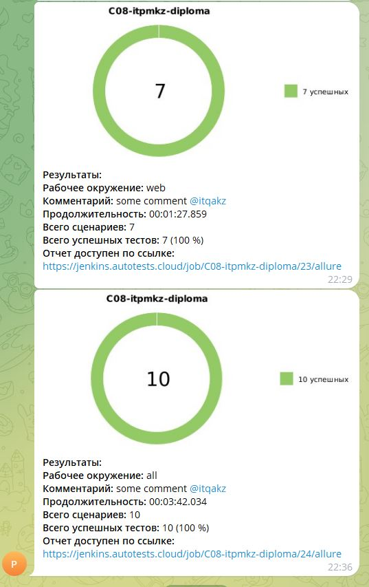
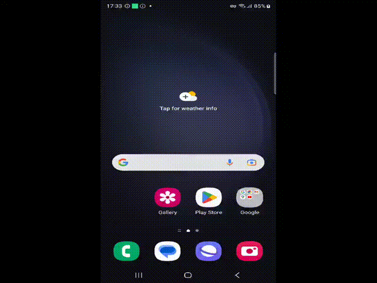

# Фреймворк для автоматизации тестирования сайта и мобильного приложения flip
> <a target="_blank" href="https://www.flip.kz/">flip.kz</a>

----

----

### Особенности проекта

* Оповещения о тестовых прогонах в Telegram
* Отчеты с видео, скриншотом, логами, исходной моделью разметки страницы
* Сборка проекта в Jenkins
* Отчеты Allure Report
* Интеграция с Allure TestOps
* Автоматизация отчетности о тестовых прогонах и тест-кейсах в Jira
* Запуск web/UI автотестов в Selenoid
* Запуск mobile автотестов в BrowserStack
* Для запуска mobile автотестов используется Appium

### Список проверок, реализованных в автотестах
- [x] Карусель на главной странице отображается (**WEB**)
- [x] Каталог на главной странице отображается (**WEB**)
- [x] Товар отображается на экране Результаты поиска (**WEB**)
- [x] Карточка товара открывается (**WEB**)
- [x] Товар в категории отображается (**WEB**)
- [x] Модальное окно Добавить в корзину отображается (**WEB**)
- [x] Товар добавленный в корзину отображается в корзине (**WEB**)
- [x] Любой первый элемент c главной страницы добавляется в избранное(**MOBILE**)
- [x] При вводе в строку поиска ключевого слова отображаются поисковые подсказки (**MOBILE**)
- [x] Клик на кнопку авторизоваться отображает окно для ввода СМС (**MOBILE**)

----

### Используемый стэк

             

----

### Локальный запуск автотестов

#### Для запуска автотестов выполнить в cli:
```bash
python -m venv .venv
source .venv/bin/activate
pip install -r requirements.txt
context="$CONTEXT" pytest . -m "${MARK}"
```
> **Где допустимые значения переменных:**<br>
> **context** - отвечает за среду выполнения тестов : local и remote. 
>>  ДЛЯ **WEB** по умолчанию установлен **local**<br>
>
>>ДЛЯ **MOBILE** по умолчанию установлен **remote**<br>
>
>**-m(aka MARK)** - отвечает за тип тестов: web, mobile, all.
----

#### Генерация отчёта:
```bash
allure serve 
```

----
### Проект в Jenkins
   
#### Проект
> <a target="_blank" href="https://jenkins.autotests.cloud/job/C08-itpmkz-diploma">Ссылка</a>

#### Запуск автотестов в Jenkins
Является параметризированным. На выбор доступны параметры, описанные выше.
Для запуска достаточно:
1. Открыть проект
2. Нажать "Build with Parameters"
3. Указать необходимые MARK и CONTEXT
4. Нажать "Build" 
----
### Allure отчет
Пример выполнения Allure отчета доступен по ссылке:
> <a target="_blank" href="https://jenkins.autotests.cloud/job/C08-itpmkz-diploma/24/allure/">Ссылка</a>
----
### Интеграция с Allure TestOps
Пример интеграции доступен по ссылке:
> <a target="_blank" href="https://allure.autotests.cloud/project/3965/dashboards">Ссылка</a>
----
### Интеграция с Jira
> <a target="_blank" href="https://jira.autotests.cloud/browse/HOMEWORK-1049">Ссылка</a>

----
### Оповещения в Telegram


----
### Видео прохождения автотестов
#### WEB

#### Mobile
